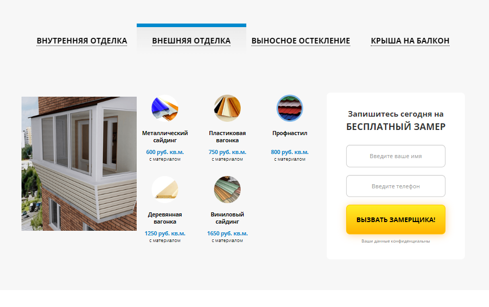
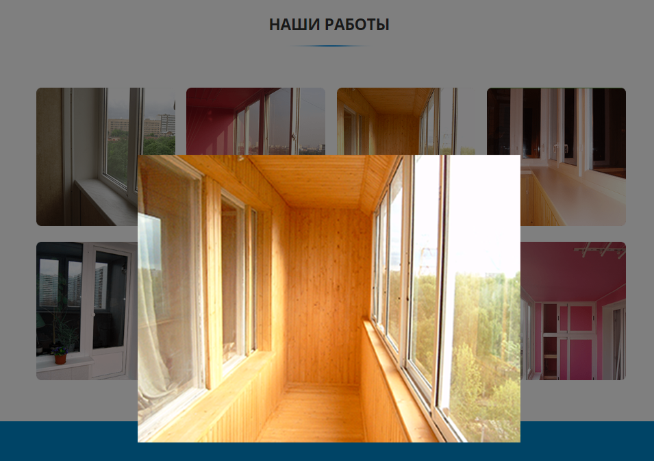

# Portfolio---Irvas    
Ирвас(остекление балконов и лоджий)  
 https://dv-nn.github.io/Portfolio---Irvas-/ 
      
:white_check_mark: Создание модального окна, реализация скрипта отправки данных на сервер без перезагрузки страницы, оповещение пользователя       
:white_check_mark: Создание калькулятора на странице: расчет стоимости работ (с указанием нескольких параметров, все данные отправляются с формой)     
:white_check_mark: Реализация табов на странице  
:white_check_mark: Создание галерии работ   
:white_check_mark: Таймер обратного отсчета  

# Стек:      
- HTML        
- CSS  
- Bootstrap      
- JS        
- Webpack 
- Gulp
     
# Screenshot:      
        
")      
")      
")      
      
 
 
